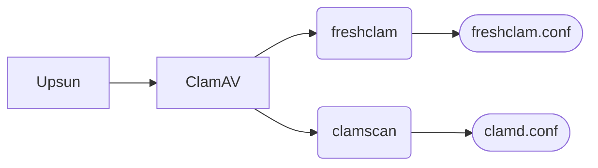

## What is ClamAV?

[ClamAV](https://github.com/Cisco-Talos/clamav) (Clam AntiVirus) is an open-source **antivirus engine** designed for detecting malwares, viruses, and other malicious threats. It is widely used for scanning file servers, and web applications. ClamAV is known for its lightweight nature and ability to be integrated into various security systems.


## Why integrate ClamAV into your web application?

Integrating ClamAV into a web application, provides several security benefits:
- **Protect uploaded files**: If your application allows users to upload files, scanning them for viruses ensures that no malicious files enter your system.
- **Regulatory compliance**: Many industries require businesses to scan files for malware as part of cybersecurity compliance.
- **Prevent system contamination**: Detecting and removing infected files early prevents malware from spreading across your infrastructure.
- **Increase user trust**: Ensuring that files are clean enhances trust in your platform, especially in cloud-based environments like Upsun.

In this tutorial we will be implementing ClamAV in **one-time scan**.  
<!-- Another ClamAV integration approach in **service mode** in [this article](/posts/deploying-clamav-service/).-->

## Using ClamAV with service mode vs one-time scan mode

There are two possible (and cumulative) policy approaches to file verification with ClamAV:
- **One-time scan mode:** This mode of ClamAV allows the user to scan an entire file tree without distinction. A pro is that all files can be scanned, however this does take a considerably long amount of time to process all the verifiers - which some may consider to be a con. 
- **Service mode:** This mode of ClamAV allows the user to scan specific files on demand. eg. the user uploads 3 new files and scans only these. A pro is that this process is very fast, due to the limitation of files to be processed, however a con is that it also requires communication between the application and the antivirus.

This tutorial covers how to run ClamAV in **one-time scan mode**.  

Another ClamAV integration approach in **service mode** in [this article](/posts/deploying-clamav-service/).

## Setting up ClamAV

{}

### Add ClamAV binary

To use ClamAV on Upsun, you need to install the ClamAV binaries.  
Let's use Upsun **[composable-image](https://docs.upsun.com/create-apps/app-reference/composable-image.html)** to add ClamAV to our application container:

```yaml {filename=".upsun/config.yaml",linenos=table,hl_lines=["6-8"],linenostart=1,base_url="https://github.com/upsun/demo-clamav/blob/master/"}
applications:
  clamav:
    source:
      root: "/"

    # Composable image feature
    stack:
      - "clamav"    # <= ClamAV binaries https://search.nixos.org/packages?channel=24.11&show=clamav
```

### Add ClamAV configuration

After adding the ClamAV binaries, you need to configure ClamAV (see the full [ClamAV documentation here](https://docs.clamav.net/)). This involves modifying two configuration files to add on the reposotory project, each corresponding to one of the two main commands:



This includes updating the **virus database** (aka `freshclam`).

Create these 2 files, `etc/freshclam.conf` and `etc/clamd.conf`, with the following:

```init {filename="etc/freshclam.conf",base_url="https://github.com/upsun/demo-clamav/blob/master/"}
# Log section
LogFileMaxSize 5M
LogTime yes
LogRotate yes

# Database upsate
DNSDatabaseInfo current.cvd.clamav.net
DatabaseMirror db.local.clamav.net
DatabaseMirror database.clamav.net
MaxAttempts 5

# Configure path
DatabaseDirectory /app/var/lib
NotifyClamd /app/var/etc/clamd.conf

```

As well as the configuration of **ClamAV itself** (for the scan, aka `clamscan`).
```init {filename="etc/clamd.conf",base_url="https://github.com/upsun/demo-clamav/blob/master/"}
# Log section
LogFile /app/var/log/clamav.log
LogFileMaxSize 5M
LogTime yes

# Configure path
DatabaseDirectory /app/var/lib
```

The storage locations for the virus database and the configuration files have been modified to adapt them to Upsun. These modifications were made by adding `DatabaseDirectory` and `NotifyClamd` to the mount points with write permissions. 

### Add mount endpoint for storage

Since ClamAV needs to write to the disk, we must add appropriate mount points with the necessary write permissions.  
```yaml {filename=".upsun/config.yaml",linenos=table,hl_lines=["9-17"],linenostart=1,base_url="https://github.com/upsun/demo-clamav/blob/master/"}
applications:
  clamav:
    source:
      root: "/"

    stack:
      - "clamav"

    mounts:
      "data": { source: storage, source_path: data } # Mount of data to scan.
      "var": { source: storage, source_path: var } # Mount of configuration/database for ClamAV.
```

Additionally, these mount points must have a **specific directory structure**.  
  
    

      
      
        

      
        
      

      
        
        

        
        

        
        
      

    
  

To do this, let's combine everything into a shell script to set up this structure (on the repository project), that will be executed during each deployment to ensure the structure's existence.
```shell {filename="scripts/clam_install.sh",base_url="https://github.com/upsun/demo-clamav/blob/master/"}
#!/usr/bin/env bash
# -*- coding: utf-8 -*-

echo "Prepare folder for clamav..."
mkdir -p \
    "${PLATFORM_APP_DIR}/var/log" \
    "${PLATFORM_APP_DIR}/var/lib" \
    "${PLATFORM_APP_DIR}/var/etc" \
    "${PLATFORM_APP_DIR}/data/folder2scan" \
    "${PLATFORM_APP_DIR}/data/quarantine" 

echo "Move config on mount..."
cp "${PLATFORM_APP_DIR}/etc/clamd.conf" "${PLATFORM_APP_DIR}/var/etc/"
```
You will note the use of the built-in variable [`PLATFORM_APP_DIR`](https://docs.upsun.com/development/variables/use-variables.html#use-provided-variables) to define the application's default path.

And let's add execution permissions to the script.
```bash {filename="Terminal"}
chmod +x scripts/clam_install.sh
```

This script can only be executed once the **mount points are mounted**, which is done in Upsun during the **deployment step**.  
To automate this, we will add the script call to the [deployment hooks](https://docs.upsun.com/create-apps/app-reference/composable-image.html#hooks).

```yaml {filename=".upsun/config.yaml",linenos=table,hl_lines=["13-17"],linenostart=1,base_url="https://github.com/upsun/demo-clamav/blob/master/"}
applications:
  clamav:
    source:
      root: "/"

    stack:
      - "clamav"

    mounts:
      "data": { source: storage, source_path: data } # Mount of data to scan.
      "var": { source: storage, source_path: var } # Mount of configuration/database for ClamAV.

    # Hook to create structure folder for ClamAV
    hooks:
      deploy: |
        set -eu
        ./scripts/clam_install.sh
```

### Deploying ClamAV on Upsun

We need to push these additions to the Upsun project. (If you don’t have one, [create a project](https://docs.upsun.com/get-started/here/create-project.html) on Upsun.)
```bash {filename="Terminal"}
git add .
git commit -m "Add ClamAV on the project"
upsun push
```

Finally, ClamAV requires a minimum set of resources to function properly, particularly for logging and updating its virus database. 
Therefore, it's important to fine-tune and [allocate sufficient resources](https://docs.upsun.com/manage-resources/adjust-resources.html) - such as memory and disk I/O - to ensure optimal performance:

- Disk : > 800Mb
- Memory : > 1.5Gb

Use this command line to upsize disk: 
```bash {filename="Terminal"}
upsun resources:set --size clamav:0.8 
```

and add ``container_profile`` parameters in your ``clamav`` settings: 

```yaml {filename=".upsun/config.yaml",linenos=table,hl_lines=["5-6"],linenostart=1,base_url="https://github.com/upsun/demo-clamav/blob/master/"}
applications:
  clamav:
    #... 
    
    # Need more RAM than CPU
    container_profile: BALANCED
```

### Test the ClamAV integration on Upsun

After the deployment, test that everything works as expected by opening an SSH connection:

```bash {filename="Terminal"}
upsun ssh
```

Let's start by triggering the update of ClamAV's virus database.
```bash {filename="SSH on Upsun",style="native",noClasses=true}
web@clamav.0:~/$ freshclam --config-file="${PLATFORM_APP_DIR}/etc/freshclam.conf"

Mon Feb 17 15:50:25 2025 -> ClamAV update process started at Mon Feb 17 15:50:25 2025
Mon Feb 17 15:50:25 2025 -> daily database available for download (remote version: 27552)
Time:    1.1s, ETA:    0.0s [========================>]   61.56MiB/61.56MiB
Mon Feb 17 15:50:28 2025 -> Testing database: '/app/var/lib/tmp.3f810acf2f/clamav-0bcf78864fd8e25406deda53ee394581.tmp-daily.cvd' ...
Mon Feb 17 15:50:43 2025 -> Database test passed.
Mon Feb 17 15:50:43 2025 -> daily.cvd updated (version: 27552, sigs: 2072975, f-level: 90, builder: raynman)
Mon Feb 17 15:50:43 2025 -> main database available for download (remote version: 62)
Time:    4.4s, ETA:    0.0s [========================>]  162.58MiB/162.58MiB
Mon Feb 17 15:50:59 2025 -> Testing database: '/app/var/lib/tmp.3f810acf2f/clamav-86fc871948269630ae1178e89bbe3e82.tmp-main.cvd' ...
Mon Feb 17 15:51:17 2025 -> Database test passed.
Mon Feb 17 15:51:17 2025 -> main.cvd updated (version: 62, sigs: 6647427, f-level: 90, builder: sigmgr)
Mon Feb 17 15:51:17 2025 -> bytecode database available for download (remote version: 335)
Time:    0.3s, ETA:    0.0s [========================>]  282.94KiB/282.94KiB
Mon Feb 17 15:51:17 2025 -> Testing database: '/app/var/lib/tmp.3f810acf2f/clamav-e5e2c8f801634258bc2f8d8119dbdd44.tmp-bytecode.cvd' ...
Mon Feb 17 15:51:17 2025 -> Database test passed.
Mon Feb 17 15:51:17 2025 -> bytecode.cvd updated (version: 335, sigs: 86, f-level: 90, builder: raynman)

```

To check that it's working as expected, let's create a file that simulates an infected file:
```bash {filename="SSH on Upsun",style="native",noClasses=true}
web@clamav.0:~/$ echo 'X5O!P%@AP[4\PZX54(P^)7CC)7}$EICAR-STANDARD-ANTIVIRUS-TEST-FILE!$H+H*' > \
    "${PLATFORM_APP_DIR}/data/folder2scan/fake.txt"
```

Now, let's run a scan:
```shell {filename="SSH on Upsun",style="native",noClasses=true}
web@clamav.0:~/$ clamscan  \
    --database="${PLATFORM_APP_DIR}/var/lib" \
    --log="${PLATFORM_APP_DIR}/var/log/scan.log" \
    --move="${PLATFORM_APP_DIR}/data/quarantine" \
    --recursive \
    "${PLATFORM_APP_DIR}/data/folder2scan"

Loading:    20s, ETA:   0s [========================>]    8.70M/8.70M sigs       
Compiling:   6s, ETA:   0s [========================>]       41/41 tasks 

/app/data/scan/fake.txt: Eicar-Signature FOUND
/app/data/scan/fake.txt: moved to '/app/data/quarantine/fake.txt'

----------- SCAN SUMMARY -----------
Known viruses: 8704755
Engine version: 1.3.2
Scanned directories: 1
Scanned files: 1
Infected files: 1
Data scanned: 0.00 MB
Data read: 0.00 MB (ratio 0.00:1)
Time: 28.929 sec (0 m 28 s)
Start Date: 2025:02:17 15:57:55
End Date:   2025:02:17 15:58:24
```

### Automating updates and scans

In order to automate the database updates and the scans, we will be grouping all the necessary commands into shell scripts to make their usage easier:

```shell {base_url="https://github.com/upsun/demo-clamav/blob/master/",filename="scripts/clam_update-db.sh"}
#!/usr/bin/env bash
# -*- coding: utf-8 -*-

echo "Update Virus database..."
freshclam --config-file="${PLATFORM_APP_DIR}/etc/freshclam.conf"
```

```shell {base_url="https://github.com/upsun/demo-clamav/blob/master/",filename="scripts/clam_scan.sh"}
#!/usr/bin/env bash
# -*- coding: utf-8 -*-

echo "Trigger scan by one-time call..."
clamscan  \
    --database="${PLATFORM_APP_DIR}/var/lib" \
    --log="${PLATFORM_APP_DIR}/var/log/scan.log" \
    --move="${PLATFORM_APP_DIR}/data/quarantine" \
    --recursive \
    "${PLATFORM_APP_DIR}/data/folder2scan"
```

Now let's add execution permissions to the script.
```bash {filename="Terminal"}
chmod +x scripts/*.sh
```

Then, automate these step by setting up some [Crons](https://docs.upsun.com/create-apps/app-reference/composable-image.html#crons):
```yaml {filename=".upsun/config.yaml",linenos=table,hl_lines=["5-17"],linenostart=1,base_url="https://github.com/upsun/demo-clamav/blob/master/"}
applications:
  clamav:
    #...
    
    # Trigger by CRON (case one-time)
    crons:
      update-db:
        spec: '0 0 * * *'
        commands:
          start: ./scripts/clam_update-db.sh
          stop: pkill freshclam

      scan-files:
        spec: 'H * * * *'
        commands:
          start: ./scripts/clam_scan.sh
          stop: pkill clamscan
```

Finally, commit everything:
```bash {filename="Terminal"}
git add .
git commit -m "Add automation (CRONs)"
upsun push
```

{}

## Extra feature

You can use **[runtime-operation](https://docs.upsun.com/create-apps/runtime-operations.html)** provided by Upsun to trigger a new scan:

{}

### Declare runtime operation

```yaml {filename=".upsun/config.yaml",linenos=table,hl_lines=["5-11"],linenostart=1,base_url="https://github.com/upsun/demo-clamav/blob/master/"}
applications:
  clamav:
    #...

    # Trigger event for one-time/service
    operations:
      trigg_clamav:
        role: viewer
        commands:
          start: |
            ./scripts/clam_scan.sh  
```

### Call runtime operation

Then, trigger this runtime operation from your development machine (or any other environment with access to the Upsun CLI).
```bash {filename="Terminal"}
upsun operation:run trigg_clamav --project <PROJECT_ID> --environment <ENVIRONMENT_NAME>
```

{}

## Conclusion

By following this guide, you have learned how to set up ClamAV on Upsun, utilizing features like Upsun composable-image and deployment hooks to automate updates and scans. This approach not only strengthens your infrastructure's security but also enhances user trust, especially in cloud environments like Upsun. With proper configuration and automation scripts, ClamAV can be a powerful tool for maintaining system integrity while remaining lightweight and easy to integrate.  

Another ClamAV integration approach in **service mode** in [this article](/posts/deploying-clamav-service/).

---

Project on our [Github Upsun](https://github.com/upsun/demo-clamav)
