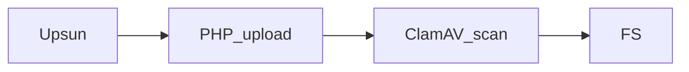

In a [previous article](/posts/deploying-clamav-onetime/), we integrated ClamAV in **one-time scan mode**. This mode takes time since it scans the integrity of a file tree.  
In this new article, we will integrate ClamAV in **Service mode** in order to scan files on demand. But let's start with a reminder about ClamAV

## What is ClamAV?

ClamAV (Clam AntiVirus) is an open-source **antivirus engine** designed for detecting malware, viruses, and other malicious threats. It is widely used for scanning file servers, and web applications. ClamAV is known for its lightweight nature and ability to be integrated into various security systems.


In this tutorial we will be implementing ClamAV in **service mode**.

## Context

In this tutorial, we will simulate a typical application requirement.  
Our example application, built in PHP (though this approach can be applied to different languages and frameworks), allows users to upload files. 
Before integrating the uploaded files into the filesystem, we want them to be scanned by ClamAV for security purposes.

Workflow:


This tutorial builds on the setup from the [previous article](/posts/deploying-clamav-onetime/).  

At this stage, we already have:  
- ClamAV binaries installed via [Composable Image](https://docs.upsun.com/create-apps/app-reference/composable-image.html)
- Writable mount points for uploaded files (`data`)
- Necessary mounts for ClamAV to function properly (`var`)

To integrate ClamAV efficiently, we will run it in daemon mode within the ``clamav`` container.

For this tutorial, we will introduce a new PHP application to upload files and use the existing ``clamav`` application to check uploaded files.
So we will need to: 
- transform our project in a [multiple application structure](https://docs.upsun.com/create-apps/multi-app.html)
- run ClamAV in [Daemon mode](https://docs.clamav.net/manual/Usage/Scanning.html?highlight=Socket#daemon)
- add a new ``app`` PHP application to upload files


## Prepare your ClamAV project
The initial step will be to prepare our source code architecture to welcome a frontend application that will display a PHP upload form.

### Create a preview environment
As we never work on the production environment, we will create a dedicated [preview environment](https://docs.upsun.com/glossary.html#preview-environment).
To create a preview environment, use the [following command line](https://docs.upsun.com/administration/cli/reference.html#environmentbranch).
It will create, on the fly, an exact copy of your parent environment (here, branch ``main``, so it's your production environment).

```bash {filename="Terminal"}
upsun environment:branch php-upload-form
```

This will create and switch to a new local Git branch ``php-upload-form`` and deploy the corresponding preview environment in less than a few minutes.

## Transform project with a multiple application structure

To prepare the project for handling multiple applications, move all existing ClamAV source code into a dedicated ``clamav`` folder.

From the root of your project source code, execute the following command lines:

```bash {filename="Terminal"}
mkdir -p clamav
for file in * .[^.]*; do
  if [[ "$file" != "clamav" && "$file" != ".upsun" && "$file" != ".git" ]]; then
    mv -- "$file" clamav/
  fi
done
```

Then, in your ``.upsun/config.yaml`` file, update the [`source.root` parameter](https://docs.upsun.com/create-apps/app-reference/single-runtime-image.html#root-directory) of your ``app`` application:

```yaml {filename=".upsun/config.yaml",linenos=table,hl_lines=["4"],linenostart=1,base_url="https://github.com/upsun/demo-clamav/tree/php-upload-form/"}
applications:
  clamav:
    source:
      root: "/clamav"
    #...
```

## Setting up ClamAV

### Enable ClamAV On-Access scanning mode
In order to run ClamAV as a service ([On-Access scanning mode](https://docs.clamav.net/manual/OnAccess.html)), we first need to enable the TCP listening mode in its configuration.
To do so, update your ``clamav/etc/clamd.conf`` file with these 2 lines at the end: 

```text {filename="clamav/etc/clamd.conf",linenos=table,hl_lines=["9-10"],linenostart=1,base_url="https://github.com/upsun/demo-clamav/tree/php-upload-form/"}
# Log section
LogFile /app/var/log/clamav.log
LogFileMaxSize 5M
LogTime yes

# Configure path
DatabaseDirectory /app/var/lib

#TCPAddr localhost
TCPSocket 3310
```

Then, update the ``clamav/scripts/clam_install.sh`` file with the following:

```bash {filename="clamav/scripts/clam_install.sh",linenos=table,hl_lines=["10-11","15-16"],linenostart=1,base_url="https://github.com/upsun/demo-clamav/tree/php-upload-form/"}
#!/usr/bin/env bash
# -*- coding: utf-8 -*-

echo "Prepare folder for clamav..."
mkdir -p \
    "${PLATFORM_APP_DIR}/var/log" \
    "${PLATFORM_APP_DIR}/var/lib" \
    "${PLATFORM_APP_DIR}/var/etc" \
    "${PLATFORM_APP_DIR}/data/folder2scan" \
    "${PLATFORM_APP_DIR}/data/quarantine" \
    "${PLATFORM_APP_DIR}/data/uploads" 

echo "Generate client/server config..."
cp "${PLATFORM_APP_DIR}/etc/clamd.conf" "${PLATFORM_APP_DIR}/var/etc/"
IP=$(ifconfig eth0 | grep "inet " | awk -F'[: ]+' '{ print $3 }')
sed -i "s/#TCPAddr localhost/TCPAddr ${IP}/g" "${PLATFORM_APP_DIR}/var/etc/clamd.conf"
```

This will get the current container IP and set it to the corresponding `TCPAddr` ClamAV variable.

### Add ClamAV to SystemD

To start ClamAV as a service, we can execute `clamd` binary within our ``clamav`` container:

```bash {filename="Terminal"}
clamd --config-file="/app/var/etc/clamd.conf"
```

However, in case of an error, there is no guarantee that the service will remain available.
To ensure continuous operation, we need to implement a watchdog mechanism. 
Upsun provides [SystemD](https://en.wikipedia.org/wiki/Systemd) in userspace mode for this purpose.

Let's start by defining a service unit file ``clamav/scripts/systemd.d/clamav.service``:

```SYSTEMD {filename="clamav/scripts/systemd.d/clamav.service",base_url="https://github.com/upsun/demo-clamav/tree/php-upload-form/"}
[Unit]
Description=Clamav Service
After=network.target
StartLimitIntervalSec=0

[Service]
Type=simple
Restart=always
RestartSec=1
TimeoutSec=30s
ExecStart=/app/.local/bin/clamd --config-file="/app/var/etc/clamd.conf" --foreground=true
ExecReload=/bin/kill -USR2 $MAINPID
ExecStartPre=/bin/mkdir -p /var/run/clamav
```

To make this unit loadable by SystemD from userspace, we need to structure the unit files directory properly.
```bash {filename="clamav/scripts/systemd_install.sh",base_url="https://github.com/upsun/demo-clamav/tree/php-upload-form/"}
#!/usr/bin/env bash
# -*- coding: utf-8 -*-

echo "Create Systemd user folder structure..."
mkdir -p ~/.config/systemd/user

echo "Copy Systemd user unit services..."
cp -R scripts/systemd.d/* ~/.config/systemd/user/
```

Then, add the unit to SystemD.
```bash {filename="clamav/scripts/systemd_init.sh",base_url="https://github.com/upsun/demo-clamav/tree/php-upload-form/"}
#!/usr/bin/env bash
# -*- coding: utf-8 -*-

echo "Reload Services"
systemctl --user daemon-reload

echo "Activating with user"
systemctl --user enable clamav.service

echo "Starting with user"
systemctl --user start clamav.service

echo "Show current services"
systemctl --user status clamav.service
```

And let's add execution permissions to the script.
```bash {filename="Terminal"}
chmod +x clamav/scripts/*
```

And,integrate all these elements into Upsun to ensure they are applied with each deployment, 
by calling `./scripts/systemd_install.sh` in your `hooks.build`, and `./scripts/systemd_init.sh` in your `hooks.deploy`:
```yaml {filename=".upsun/config.yaml",linenos=table,hl_lines=["14-16","20"],linenostart=1,base_url="https://github.com/upsun/demo-clamav/tree/php-upload-form/"}
applications:
  clamav:
    source:
      root: "/clamav"
    stack:
      - "clamav"
    build:
      flavor: none
    container_profile: BALANCED
    mounts:
      "data": { source: storage, source_path: data } # Mount of data to scan.
      "var": { source: storage, source_path: var } # Mount of configuration/database for ClamAV.
    hooks:
      build: |
        set -eu
        ./scripts/systemd_install.sh
      deploy: |
        set -eu
        ./scripts/clam_install.sh
        ./scripts/systemd_init.sh
    #...
```

### Deploying ClamAV on Upsun

We need to push these additions to the Upsun project.
```bash {filename="Terminal"}
git add .
git commit -m "Add ClamAV service to SystemD"
upsun push
```

After deployment, you can check that ClamAV is listening to port ``3310`` by connecting to the `clamav` container and execute `netstat -laputne` command line: 

```bash {filename="Terminal",linenos=table,hl_lines=["5"],linenostart=1}
upsun ssh --app clamav -- netstat -laputne
#...
Active Internet connections (servers and established)
Proto Recv-Q Send-Q Local Address Foreign Address State  User  Inode      PID/Program name
tcp        0      0 0.0.0.0:3310  0.0.0.0:*       LISTEN 10000 425818084  308/clamd
```



  **Troubleshoot**: If you don't, please be sure that the ClamAV database has been initialized, at least once. 
  If not, execute the following command line: 

  ```bash {filename="Terminal"}
  upsun ssh --app=clamav -- ./scripts/clam_update-db.sh
  ```



## Add ``app`` PHP application
This basic PHP application will display a basic form to upload a file and then use an external library ([``appwrite/php-clamav``](https://github.com/appwrite/php-clamav)) to perform the ClamAV scan.

### Create an ``app`` folder
Our ``app`` source code will be located in a `app` folder. To create this folder, execute the following:

```bash {filename="Terminal"}
mkdir -p app
```

### Create the upload form
All the logic of this PHP form will be located in a ``public/index.php`` file, with the following:

```php {filename="app/public/index.php",base_url="https://github.com/upsun/demo-clamav/tree/php-upload-form/"}
<h2>Upload and scan a file</h2>
<?php
require_once $_ENV['PLATFORM_APP_DIR'] . '/vendor/autoload.php';

use Appwrite\ClamAV\Network;

if (isset($_POST['upload_form'])) {
  $clam = new Network($_ENV['CLAMAV_HOST'], '3310');
  
  if ($clam->ping()) { // Check ClamAV is up and running
    $scanDestination = $_ENV['PLATFORM_APP_DIR'] . "/data/folder2scan/" . $_FILES['upfile']['name'];
    $uploadDestination = $_ENV['PLATFORM_APP_DIR'] . "/data/uploads/" . $_FILES['upfile']['name'];
    $quarantineDestination = $_ENV['PLATFORM_APP_DIR'] . "/data/quarantine/" . $_FILES['upfile']['name'];
    
    // Move candidate file to a shared folder with clamav app
    move_uploaded_file($_FILES['upfile']['tmp_name'], $scanDestination);
    
    if ($clam->fileScan($scanDestination)) {
      rename($scanDestination, $uploadDestination);
      echo "</br>No virus detected in " . $_FILES['upfile']['name'];
    } else {
      rename($scanDestination, $quarantineDestination); // move infected file to the data/quarantine folder
      echo "</br>You try to upload an infected file or the file does not exist, you should use an antivirus on your local machine.";
    }
  } else {
    echo "</br>ClamAV is not running, starting ClamAV daemon can take some time, please retry later";
  }
}
?>

<form method="POST" action="<?php echo $_SERVER['PHP_SELF']; ?>" enctype="multipart/form-data">
  <label for="file">File to Upload:</label></br>
  <input type="file" name="upfile" required></br>
  <input type="submit" value="Upload" name="upload_form"/>
</form>
```

Please note that before scanning this candidate file, we first move the file into the shared ``/data/folder2scan/`` folder for `clamav` app being able to scan the file. 
If ClamAV does not detect any threat, then the file is moved to a final ``/data/uploads/`` folder, moved otherwise in the `/data/quarantine/` folder.     

### Import ``appwrite/php-clamav`` library
We will need to import [``appwrite/php-clamav``](https://github.com/appwrite/php-clamav) library using Composer.

From the ``app`` folder, execute the following command line: 

```bash {filename="Terminal"}
cd app
composer require appwrite/php-clamav
cd ..
```

### Configure ``app`` application
Then, we need to declare a new ``app`` Upsun application. 

Update your ``.upsun/config.yaml`` file with the following: 

```yaml {filename=".upsun/config.yaml",linenos=table,hl_lines=["4-29"],linenostart=1,base_url="https://github.com/upsun/demo-clamav/tree/php-upload-form/"}
applications:
  clamav:
    #...
  app:
    source:
      root: "/app"
    type: php:8.3
    container_profile: BALANCED
    web:
      locations:
        "/":
          root: "public"
          expires: 1h
          passthru: "/index.php"
    mounts:
      "var": { source: storage, source_path: var, service: clamav }
      "data": { source: storage, source_path: data, service: clamav }
    hooks:
      build: |
        set -x -e
        composer install
    relationships:
      clamav:
        service: "clamav"
        endpoint: "http"

routes:
  "https://{all}/": { type: upstream, upstream: "app:http", primary: true}
  "http://{all}/": { type: redirect, to: "https://{all}/" }
```



Some information on this ``app`` configuration:
- **line 16-17**: please note the ``service: clamav`` parameter. This additional parameter allows `app` and `clamav` apps sharing the same NFS folders (see [Share a mount between several apps documentation page](https://docs.upsun.com/create-apps/app-reference/single-runtime-image.html#share-a-mount-between-several-apps)). This will be useful for our `app` application to upload files to scan in a directory shared with the `clamav` application (ClamAV scan only local files).   
- **line 25-28**: we add a [relationship](https://docs.upsun.com/create-apps/multi-app/relationships.html#relationships-example) from ``app`` to ``clamav``. This will enable internal communication between apps and expose environment variables within the `app` container with `clamav` app info (see `CLAMAV_*` envVars in your `app` container).



## Deploy

Finally, we need to push all of this on our Upsun project.

```bash {filename="Terminal"}
git add .
git commit -m "Add app application"
upsun push
```

## Test it
You can then open the frontend by using the following command line: 

```bash {filename="Terminal"}
upsun environment:url --primary
```

You should end up on this frontend page:



You can start playing with safe and infected files.

As mention in the [previous episode](/posts/deploying-clamav-onetime/), 
you can simulate an infected file by creating a local ``fake.txt`` file with such a source code: 

```text {filename="fake.txt"}
X5O!P%@AP[4\PZX54(P^)7CC)7}$EICAR-STANDARD-ANTIVIRUS-TEST-FILE!$H+H*
```

This is a [typical ``Eicar-Signature``](https://en.wikipedia.org/wiki/EICAR_test_file) virus, 
and is totally safe for your local machine and for your Upsun application.

 

  **Please note**: some local antivirus software, as [SentinelOne](https://fr.sentinelone.com/), 
  will detect this file as a virus and will immediately move them, after saving it, to your local quarantine folder, 
  and so, this __infected__ file will disappear from your machine. 
  We had a hard time finding a way to test it. 
  
  **Tips**: we used a non-protected laptop (😇) to upload it.



After uploading this ``fake.txt`` file, you should get such a response: 



## Conclusion

Both methods (one-time scan and service mode) can coexist within the same project.  
For example, we can scan files at the time of upload to ensure immediate security checks while also running a full scan of the entire file repository every night.

---

Project on our [Github Upsun](https://github.com/upsun/demo-clamav/tree/php-upload-form/) (branch ``php-upload-form``)
